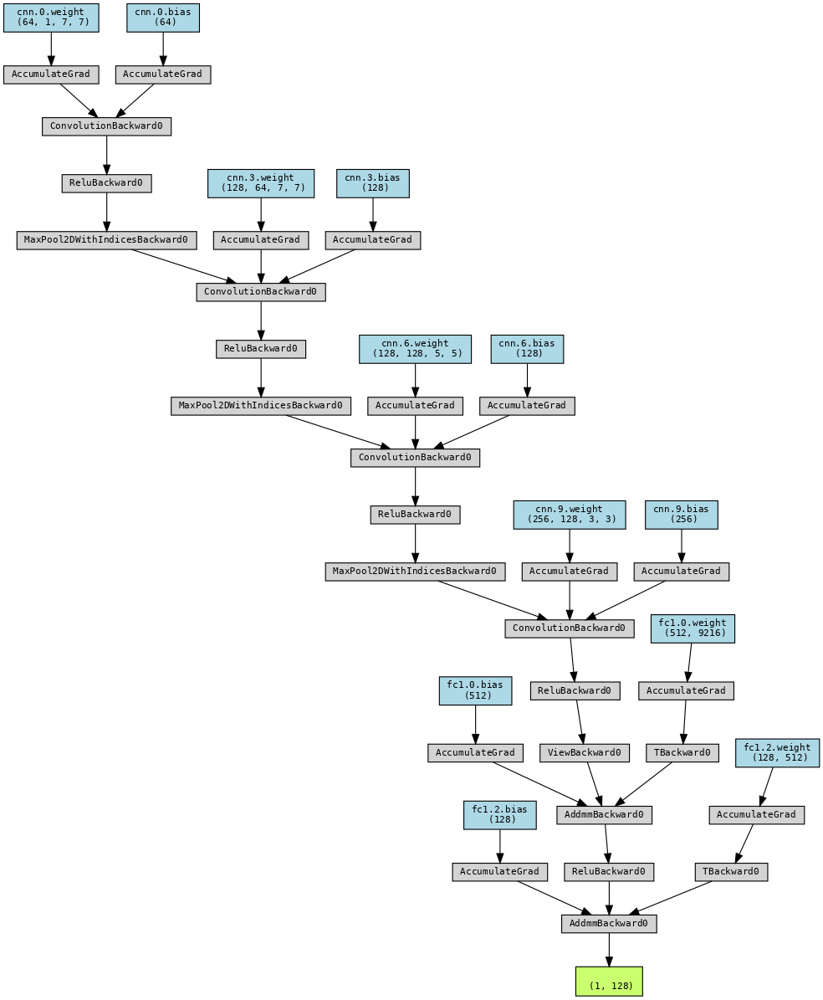

# Face-recognization-Triplet-Siamese

One-shot type face recogniaztion based on Pytorch.

# Dataset
Face Recognition Dataset - Oneshot Learning  
Labeled Faces in the Wild (LFW) Face Dataset

# Architecture
- Siamese neural network with Triplet loss
- The network model architecture is shown in the figure

    

 

# Experiment
- The final result achieves an accuracy of 92%.
- The variation of the loss value during the training process is shown in the figure.

    

 
